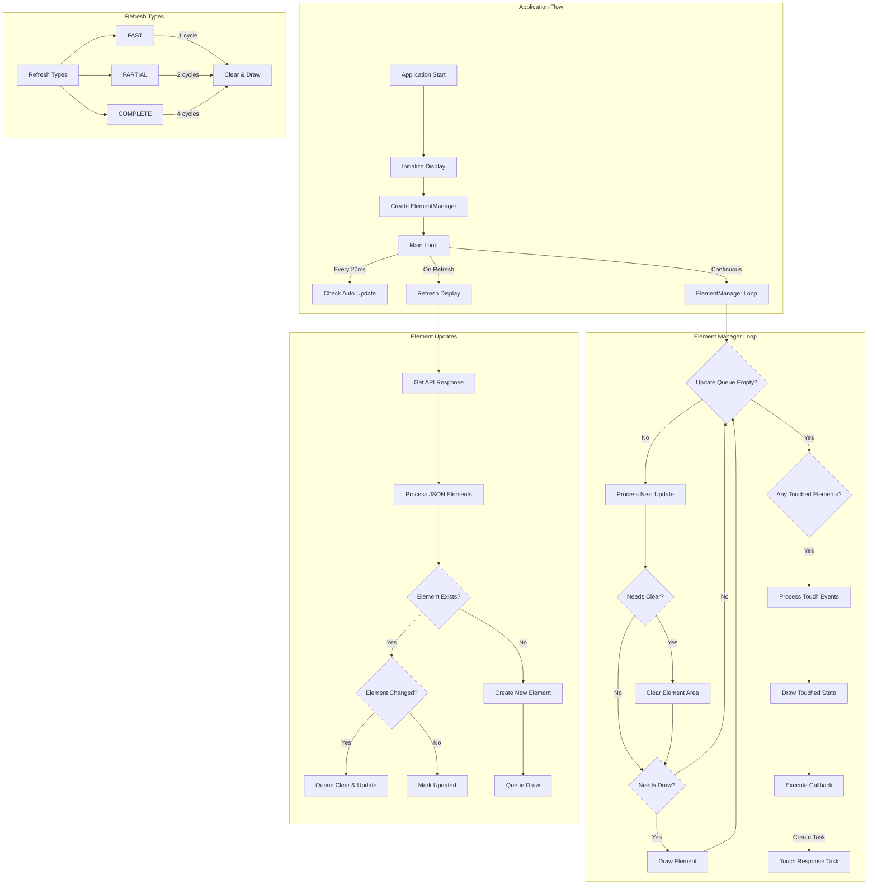

###TODO:
- Calculate (and set) bounds outside of draw 
- Fix update on dark mode when switching
- Image invert function
    - Could be sent and done on the server
- Spotify track max length
- Standardize the button width / height

